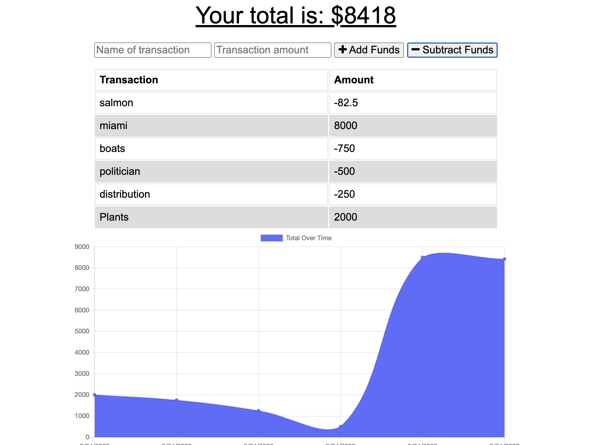

# Budget Tracker Starter Code

**Version 1.0.0**

## The Purpose
The purpose of this project was to enable offline functionality using IndexedDB for offline storage of data in the object store as well as cache storage to render pages to the client in times of internet distress, and poor connectivity.

## Significant Changes
This project required us to utilize our knowledge of offline functionality to create a friendly user experience despite poor connectivity. This functionality allows us to not only render pages from cache, but also we can store objects in the object store temporarily until internet connection is restored thereby allowing us to use fetch to post to the database.

## Usage
Enter transactions to view a graph and a list of your income and expenses. To test out offline capability, go to developer tools, network, and select offline. To delete all data, go to developer tools, application, storage, and check IndexedDB and Cache Storage before clicking clear site data.

## Screenshot

## Deployed Link
https://speedy-budget.herokuapp.com/

## License and Copyright
© Xander Rapstine, Trilogy Education Services/2U